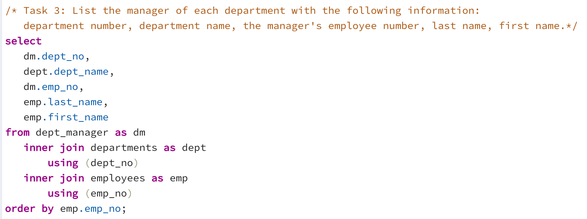

# EmployeeSQL

This project uses pgAdmin SQL to analyze employees information of an cooporation from the 1980s and the 1990s. All that remain of the database of employees from that period are six CSV files. This project includes four major steps - data modeling, data engineering (SQL), data anlysis (SQL), data visualization (Python and Matplotlib). In the data anlysis step, it uses **inner join** and **left join** to retrieve data from multiple tables. It uses **where** to set parameters to analyze data that meet certain criteria and uses **order by** to sort data in a desired order. It also utitlized count as and group by to list the frequency count of a selected group of data. Please see details below.

### Step 1: Date Modeling
* Inspect the CSVs and sketch out an ERD of the tables.
* 

### Step 2: Data Engineering
* Use the information provided to create a table schema for each of the six CSV files. Data types, primary keys, foreign keys, and other constraints are specified. 
* 

* Import each CSV file into the corresponding SQL table.

### Step 3: Data Anlysis
Here are the guided questions.
1. List the following details of each employee: employee number, last name, first name, sex, and salary.
- 
-
2. List first name, last name, and hire date for employees who were hired in 1986.
- 
-
3. List the manager of each department with the following information: department number, department name, the manager's employee number, last name, first name.
- 
-
4. List the department of each employee with the following information: employee number, last name, first name, and department name.
- 
-
5. List first name, last name, and sex for employees whose first name is "Hercules" and last names begin with "B."
- 
-
6. List all employees in the Sales department, including their employee number, last name, first name, and department name.
- 
-
7. List all employees in the Sales and Development departments, including their employee number, last name, first name, and department name.
- 
-
8. In descending order, list the frequency count of employee last names, i.e., how many employees share each last name.
- 
-

### Step 3: Data Visualization
The last step is to visualize the data by importing the SQL database into Pandas by using sqlalchemy. 

* Import the SQL database into Pandas
* - 

* Create a histogram to visualize the most common salary ranges for employees.
* * - 

* Create a bar chart of average salary by title.
* * - 

